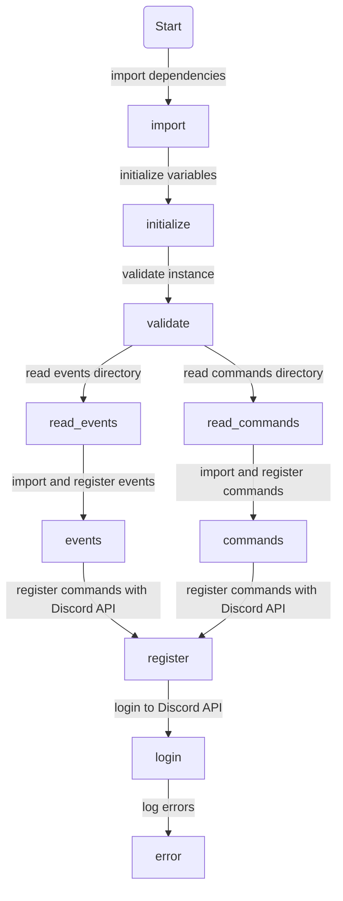

# Typescript Discord Bot

This is a script for creating an implementation for creating a Discord bot using the Discord.js and the Typescript. It sets up the bot's connection to the Discord API, imports and executes event and action files, and registers slash commands to the Discord API.

## Features

* Imports and registers commands and events from the /actions and /events directories respectively.
* Classifies commands as slash or prefixed commands.
* Uses the .env file to set the DISCORD_TOKEN and DISCORD_CLIENT_ID.
Logs in to the Discord API using the provided token.
* Listens to unhandled rejection, uncaught exception and uncaught exception monitor events and logs them.

---

## Dependencies

* discord.js
* mongoose

## devDependencies

* dotenv
* ts-node-dev
* tsconfig-paths
* typescript

## Usage

1. Clone the repository.
2. Install dependencies using :

    ```bash
    npm Install
    ```

3. Create a .env file in the root directory and set the environment variables.

    ```bash
    cp .env.example .env
    ```

4. Run the script using development mode using :

    ```bash
    npm run dev
    ```

---

## Environment Variables

### Required variables

```bash
DISCORD_CLIENT_ID
DISCORD_TOKEN
```

### Optional variables

```bash
NODE_ENV
```

> NODE_ENV will be set to "dev" if not provided. Set NODE_ENV to "production" for production.

## Workflow



* The code starts by importing various modules from the discord.js library, including the Client, Collection, GatewayIntentBits, REST, and SlashCommandBuilder. It also imports utility functions and types from a local @/utils directory. The code then sets up a REST client and a new Client with specific intents, and assigns a token for the client to use for login.
* Next, the code creates new collections for commands and slash commands, and defines several variables such as the default command prefix and counters for events and actions. It also sets up the file paths for the actions and events directories.
* The code then reads the files in these directories and imports them as modules. For each event file, the code increments the event counter and attaches the module's default execute function to the client's corresponding event. For each action file, the code increments the action counter, checks if the action is a slash command, and adds it to the appropriate collection. It also adds the slash command to an array of parsed slash commands, which are used later to register the commands with the Discord API.
* After all the files have been processed, the parsed slash commands are registered with the API. The code also sets up listeners for various Node.js errors and logs them using the custom logger function. Finally, the client logs in to the Discord API using the token provided in the instance object.

---

## Utilities

1. `validateInstance(instance: { token: string })`: Checks if the token is provided and if not it throws an error saying "No token provided."
2. `registerCommands({ commands, clientId, rest }: { commands: any[]; clientId: string | undefined; rest: REST; })`: Registers the commands by sending a PUT request to the Discord API.
3. `logger({ message, type }: { message: string; type: string | null; })`: Logs the messages along with the timestamp, icon and color depending on the type of the message.
getRandomNumber(length: number = 1): number: Generates a random number of specified length.
4. `setGuildOption({ guild, option }: { guild: Guild; option: GuildOption; })`: Not implemented in this script, it's not doing anything.
5. `nodejsErrorListener()`: Listens to unhandled rejection, uncaught exception and uncaught exception monitor events and logs them.

## Types

The types.d.ts file defines TypeScript interfaces for the project.

### Action

The `Action` interface defines the structure of an action, which can be either a command or an event.

* `name`: The name of the action.
* `description`: The description of the action.
* `parameter`: The parameter that triggers the action.
* `execute()`: The function that gets executed when the action is triggered. It takes in a Message object and an array of arguments as parameters.
* `permissions`: An array of permissions required to execute the action.
* `aliases`: An array of alternative parameter names that can trigger the action.
* `cooldown` : cooldown time for the action
* `slash` : boolean value to check if it's a slash command or not
* `autocomplete()` : function that get executed when a user tries to autocomplete command

### GuildOption

The `GuildOption` interface defines the structure of options for a guild. It is an object that maps keys to any value.

---

## Note

Make sure to have the latest version of Node.js installed on your system. This script is only compatible with version 12 or higher.

Additionally, make sure to also add your custom actions and events to the corresponding /actions and /events directories, and make sure to conform to the structure defined in the Action interface.

The `setGuildOption` function is currently not implemented in the script, so feel free to use it or modify it to fit your needs if you plan on using it.

The script also uses the REST class from discord.js to register slash commands to the bot's application, so make sure to set the `DISCORD_CLIENT_ID` in your .env file if you plan on using slash commands.

It's important to keep in mind that this script is designed as a starting point and may need to be modified to fit your specific use case.
